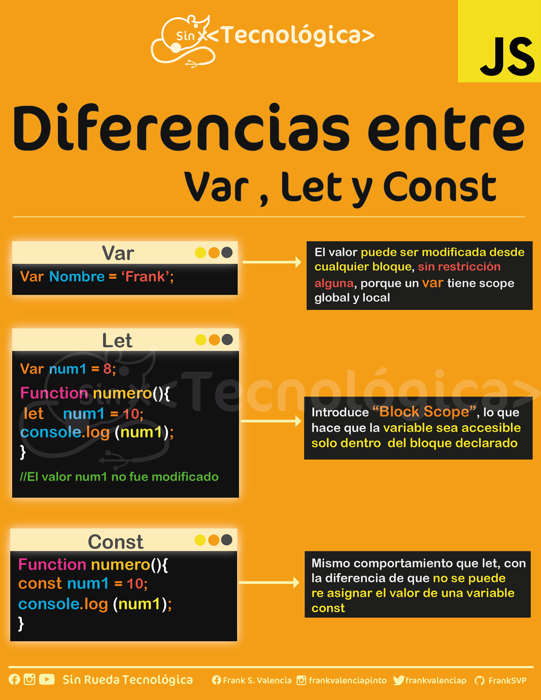
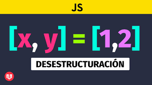
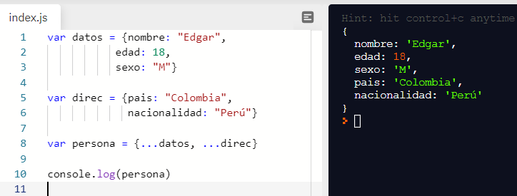
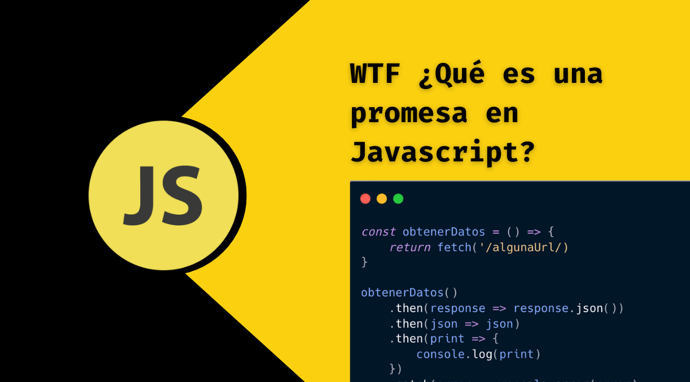
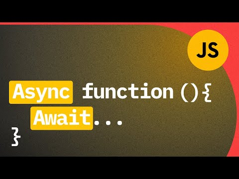

# ¿Qué tipo de bucles hay en JS?


Hay tres tipos de bucles en JavaScript:

    for
    for…of и for…in
    .forEach

## Clásico bucle for

Este es un bucle for clásico, donde usted define un contador interno, especifica una condición para detener el bucle y cambia el paso (generalmente aumentando o disminuyendo el contador).

Sintaxis:
```JavaScript
for([counter definition];[breaking condition definition];[step definition]){
   //... tu código duplicado}
```
Ejemplo:
```JavaScript
for(let counter = 0; counter < 10; counter++) {
  console.log(counter)
}
```
Este código funciona bien, pero el diseño de este tipo de bucle podría ser más flexible que en este ejemplo. Así es como puedes imaginar este diseño:
```JavaScript
for(
 [EXPRESIÓN EJECUTADA SÓLO UNA VEZ AL INICIO DEL BUCLE];
  [CONDICIÓN QUE SE VERIFICA EN CADA PASO DEL BUCLE];
  [EXPRESIÓN QUE SE EJECUTA EN CADA PASO DEL BUCLE]
 )
```
Es decir, puedes crear bucles con más de un contador, por ejemplo. O ejecutar código en cada paso, lo que puede que ni siquiera afecte a los contadores. Déjame darte algunos ejemplos.

Aquí hay un bucle totalmente válido:
```JavaScript
for(let a = 0, b = 0; a < 10 && b < 100; a++, b+=10) {
   console.log(a, b)
}
/*
0 0
1 10
2 20
3 30
4 40
5 50
6 60
7 70
8 80
9 90
*/
```
Puedes ir aún más allá de los casos típicos, como en el ejemplo anterior:
```JavaScript
for(let a = 0, b = 0; a < 10 && b < 100; console.log("Your counters are at:", ++a, b+=2)){}
/*
Your counters are at: 1 2
Your counters are at: 2 4
Your counters are at: 3 6
Your counters are at: 4 8
Your counters are at: 5 10
Your counters are at: 6 12
Your counters are at: 7 14
Your counters are at: 8 16
Your counters are at: 9 18
Your counters are at: 10 20
*/
```
Incluso puedes reemplazar la expresión intermedia de la llamada a la función, sin olvidar que el valor de retorno de la función se convertirá en un valor booleano.
```JavaScript
function isItDone(a) {
 console.log("fn called!")
 return a < 10
}

for(let a = 0; isItDone(a); a++) {
 console.log(a)
}
/*
fn called!
0
fn called!
1
fn called!
2
fn called!
3
fn called!
4
fn called!
5
fn called!
6
fn called!
7
fn called!
8
fn called!
9
fn called!
*/
```
¿Qué hacer con código asincrónico dentro de un bucle clásico? Gracias a la nueva característica: async/await, todo se soluciona de forma sencilla:
```JavaScript
const fs = require("fs")

async function read(fname) {
    return new Promise( (resolve, reject) => {
        fs.readFile(fname, (err, content) => {
            if(err) return reject(err)
            resolve(content.toString())
        })
    })
}

(async () => {
    let files = ['file1.json', 'file2.json']

    for(let i = 0; i < files.length; i++) {
        let fcontent = await read(files[i])
        console.log(fcontent)
        console.log("-------")
    }
})()
```
Observe lo fácil que es utilizar un bucle. Es como si no hubiera asincronía. Con async/await, volvemos a confiar en una construcción básica como un bucle for para iterar a través de un conjunto de instrucciones asincrónicas.

Anteriormente usábamos devoluciones de llamada y promesas para lograr el mismo resultado, por lo que la lógica era mucho más compleja. Para simplificarlo, han aparecido bibliotecas especiales, como async.js.

Por cierto, una nota rápida: el bucle for en mi ejemplo está dentro de un IIFE simplemente porque la declaración de await debe estar dentro de una función asincrónica para evitar problemas debido a Node.

## for…of y for…in

Este diseño es muy similar al anterior, pero al mismo tiempo tiene características propias.

El bucle for...in procesa propiedades enumerables que no son caracteres de un objeto (la palabra clave aquí es "objeto" porque casi todo en JavaScript es un objeto). Este bucle es especialmente útil cuando se utiliza un objeto personalizado como mapa hash o diccionario (una práctica muy común).

Tenga en cuenta que la iteración se realiza en orden aleatorio, por lo que si necesita el "orden correcto", asegúrese de tener control sobre este proceso.
```JavaScript
let myMap {
  uno: 1,
  dos: 2,
  tres: 3
}
for(let key in myMap) {
  console.log(key, "=", myMap[key]);
}
/*
uno = 1
dos = 2
tres = 3
*/
```
Parece bastante simple. Pero recuerde que casi todo en JavaScript es un objeto, por lo que puede ser fácil confundir cuándo necesita un bucle for... in y cuándo necesita un bucle for... of. Por ejemplo, si quisieras iterar sobre cada carácter en una cadena (que es un objeto), esto es lo que sucedería si usaras for... in:
```JavaScript
for(let k in "Hello World!") {
   console.log(k)
}
/*
0
1
2
3
4
5
6
7
8
9
10
11
*/
```
En lugar de iterar sobre cada letra de la cadena, el bucle iteró sobre cada propiedad y, como puede ver, esta estructura (para un tipo de cadena) es muy similar a una matriz. Y esto tiene sentido. Si especifica "Hello World!", el bucle fallará y devolverá la letra "e".

Si desea iterar sobre cada carácter, entonces necesita usar la opción: for...of
```JavaScript
for(let char of "Hello World!") {
  console.log(char)
}
/*
H
e
l
l
o
 
W
o
r
l
d
!
*/
```
Ahora esto tiene sentido. Misma tarea, pero con for...of accedes a los valores de un iterable (los iterables pueden ser cadenas, matrices, mapas, conjuntos y estructuras tipo matriz como arguments y NodeList), siempre y cuando los definas como iterable, por supuesto.

En el ejemplo anterior, no existe una forma directa de obtener el índice actual del bucle a menos que lo defina fuera del bucle y lo actualice en cada paso. El índice y el valor se pueden obtener utilizando el método de entries en matrices, por ejemplo:
```JavaScript
let myArr = ["hello", "world"]
for([idx, value] of myArr.entries()) {
    console.log(idx, '=', value)
}
/*
0 '=' 'hello'
1 '=' 'world'
*/
```
¿Qué pasa con el código asincrónico? Exactamente lo mismo.
```JavaScript
const fs = require("fs")

async function read(fname) {
    return new Promise( (resolve, reject) => {
        fs.readFile(fname, (err, content) => {
            if(err) return reject(err)
            resolve(content.toString())
        })
    })
}

(async () => {
    let files = ['file2.json', 'file2.json']

    for(fname of files) {
        let fcontent = await read(fname)
        console.log(fcontent)
        console.log("-------")
    }

    for(idx in files) {
        let fcontent = await read(files[idx])
        console.log(fcontent)
        console.log("-------")
    }
})()
```
Ambos bucles se comportan igual con la construcción await, lo que le permite escribir código más simple y limpio.

## Bucle .forEach

Los tipos de bucle anteriores funcionan muy bien y tienen sus ventajas en ciertos casos, pero también son muy imprescindibles. Es decir, deberíamos escribir qué debería pasar con los datos y no qué queremos hacer con ellos.

El método .forEach es otro tipo de bucle for. Es parte de un objeto de matriz y está destinado a recibir una función y un parámetro opcional adicional para redefinir el contexto de esa función cuando se ejecuta.

Para cada elemento dentro de la matriz, la función se ejecutará y recibirá tres argumentos (sí, así es, tres argumentos, no uno, como es habitual). Estos son los argumentos:

* El elemento que se está procesando actualmente.
* El índice del elemento (esto ya simplifica el problema que intentamos resolver usando el bucle for...of).
* La propia matriz procesada. En caso de que necesites hacer algo con él.

Un pequeño ejemplo:
```JavaScript
a = ["hello", "world"]

a.forEach ( (elem, idx, arr) => {
   console.log(elem, "at: ", idx, "inside: ", arr)
})
/*
hello at:  0 inside:  [ 'hello', 'world' ]
world at:  1 inside:  [ 'hello', 'world' ]
*/
```
Rapido y facil. Vea lo fácil que es trabajar con atributos dentro de una función. A continuación se muestra un ejemplo de cómo puede utilizar el segundo parámetro adicional del método forEach:
```JavaScript
class Person {
    constructor(name)  {
        this.name = name
    }
}

function greet(person) {
    console.log(this.greeting.replace("$", person.name))
}

let english = {
    greeting: "Hello there, $"
}
let spanish = {
    greeting: "Hola $, ¿cómo estás?"
}

let people = [new Person("Fernando"), new Person("Federico"), new Person("Felipe")]


people.forEach( greet, english)
people.forEach( greet, spanish)
```

Al sobrescribir el contexto de la función greet que se llama, puedo cambiar su comportamiento sin cambiar su código.

En conclusión, quiero mostrar que este método también funciona con código asincrónico. He aquí un ejemplo:
```JavaScript
const fs = require("fs")

async function read(fname) {
    return new Promise( (resolve, reject) => {
        fs.readFile(fname, (err, content) => {
            if(err) return reject(err)
            resolve(content.toString())
        })
    })
}

let files = ['file1.json', 'file2.json']

files.forEach( async fname => {
    let fcontent = await read(fname)
    console.log(fcontent)
    console.log("-------")
})
```
Tenga en cuenta que ya no necesito el IIFE porque declaro la devolución de llamada como async.
***

# ¿Cuáles son las diferencias entre const, let y var?



## Var
### Área de visibilidad de Var
El alcance esencialmente indica dónde están disponibles para su uso determinadas variables. Las declaraciones var pueden tener visibilidad global o local (alcance dentro de la función).

La variable var es global cuando se declara fuera de una función. Esto significa que cualquier variable declarada con var fuera de un bloque de funciones está disponible para su uso en toda la ventana.

Var es local cuando se declara dentro de una función. Esto significa que es accesible y solo se puede acceder a él desde esa función.

Para entenderlo mejor, veamos un ejemplo:
```JavaScript
    var greeter = "hey hi";
    
    function newFunction() {
        var hello = "hello";
    }
```
Aquí la variable greeter es global porque está fuera de cualquier función y hello está limitada a la función. Entonces no podemos acceder a la variable hello desde fuera de esta función. Entonces, si intentas hacerlo así:
```JavaScript
    var tester = "hey hi";
    
    function newFunction() {
        var hello = "hello";
    }
    console.log(hello); // error: hello is not defined
```
...habrá un error en la salida. Esto sucede porque no se puede acceder a la variable hello fuera de la función específica.
Las variables var se pueden redeclarar o actualizar.

Esto significa que podemos hacer esto dentro del alcance apropiado y no obtener un error.
```JavaScript
    var greeter = "hey hi";
    var greeter = "say Hello instead";
```
O incluso así:
```JavaScript
    var greeter = "hey hi";
    greeter = "say Hello instead";
```

### Elevando var

El levantamiento es un mecanismo en JavaScript mediante el cual las variables y declaraciones de funciones se mueven a la parte superior de su alcance antes de que comience la ejecución del código. Esto significa que si lo haces así:
```JavaScript
console.log (greeter);
var greeter = "say hello"
```
...entonces se interpretará así:
```JavaScript
var greeter;
console.log(greeter); // greeter is undefined
greeter = "say hello"
```
De esta manera, las variables var se elevan a la parte superior de su alcance y se inicializan con el valor undefined.

### Problema con var

Hay una debilidad que viene con var. Para explicarlo, pondré un ejemplo a continuación:
```JavaScript
    var greeter = "hey hi";
    var times = 4;

    if (times > 3) {
        var greeter = "say Hello instead"; 
    }
    
    console.log(greeter) // "say Hello instead"
```
Como puede ver, dado que times > 3 devuelve true, el valor de la variable greeter se redefine como "say Hello instead". Aunque esto no es un problema si desea lograr deliberadamente dicha anulación para el greeter. El problema viene cuando no te das cuenta de que la variable greeter ya ha sido definida previamente.

Si ha utilizado greeter en otras partes de su código, se sorprenderá con el resultado. Esto seguramente causará muchos errores en su código. Por eso se necesitan let y const.

## Let

let es ahora la opción preferida para declarar variables. Como era de esperar, let actúa como una mejora en la declaración var y también resuelve el problema con var del que acabamos de hablar.
let tiener un alcance de bloque

Un bloque es un fragmento de código delimitado por llaves {}. Todo lo que está dentro de las llaves pertenece al bloque.

Por lo tanto, una variable declarada en un bloque mediante let solo será accesible dentro de ese bloque. Veamos un ejemplo:
```JavaScript
   let greeting = "say Hi";
   let times = 4;

   if (times > 3) {
        let hello = "say Hello instead";
        console.log(hello);// "say Hello instead"
    }
   console.log(hello) // hello is not defined
```
Aquí puede ver que un intento de utilizar hello fuera del bloque (las llaves dentro de las cuales se definió la variable) devuelve un error. Esto sucede porque las variables let son variables de bloque.
Las variables let se puedan actualizar pero no redeclarar

Al igual que con var, las variables declaradas con let se pueden actualizar dentro de su alcance. Pero, a diferencia de var, las variables let no se pueden volver a declarar dentro del alcance. Aunque esto funcionará:
```JavaScript
    let greeting = "say Hi";
    greeting = "say Hello instead";
```
este código ya devolverá un error:
```JavaScript
    let greeting = "say Hi";
    let greeting = "say Hello instead"; // error: Identifier 'greeting' has already been declared
```
Sin embargo, si una variable con el mismo nombre se define en diferentes ámbitos, no habrá ningún error:
```JavaScript
let greeting = "say Hi";
    if (true) {
        let greeting = "say Hello instead";
        console.log(greeting); // "say Hello instead"
    }
  console.log(greeting); // "say Hi"
```
¿Por qué no hay ningún error? Esto sucede porque ambas instancias se tratan como variables diferentes porque tienen alcances diferentes.

Esto es lo que hace que let sea una mejor opción que var. Al usar let, no tiene que preocuparse por si ya tiene una variable con ese nombre antes, porque la variable solo existe dentro de su alcance.

Además, dado que una variable dentro de un alcance específico solo se puede declarar una vez, el problema que discutimos anteriormente con var ya no se aplica.

### Elevando let

Al igual que con var, dejemos que las declaraciones suban. Pero a diferencia de las variables var, que se inicializan como undefined, la palabra clave let no se inicializa. Entonces, si intenta utilizar una variable let antes de haberla declarado, obtendrá ReferenceError.

## Const

Las variables declaradas usando const conservan valores constantes. Las declaraciones que usan const tienen algunas similitudes con las declaraciones que usan let.

const tiene alcance de bloque.
Al igual que con let, solo se puede acceder a las variables declaradas como const dentro del bloque donde fueron declaradas.

Las variables const no se pueden actualizar ni redeclarar
Esto significa que el valor de una variable declarada como const permanece sin cambios dentro de su alcance. No se puede actualizar ni volver a declarar. Entonces, si declaramos una variable const, no podemos hacer ninguna de estas cosas:
```JavaScript
    const greeting = "say Hi";
    greeting = "say Hello instead";// error: Assignment to constant variable.
```
…así no:
```JavaScript
    const greeting = "say Hi";
    const greeting = "say Hello instead";// error: Identifier 'greeting' has already been declared
```
Por lo tanto, cada declaración const debe inicializarse en el momento de la declaración.

Este comportamiento es ligeramente diferente cuando se trata de objetos declarados mediante const. Aunque un objeto const no se puede actualizar, las propiedades de dichos objetos se pueden actualizar. Por lo tanto, si declaras un objeto const como este:
```JavaScript
  const greeting = {
        message: "say Hi",
        times: 4
    }
```
... entonces, no hagamos esto:
```JavaScript
const greeting = {
        words: "Hello",
        number: "five"
    } // error:  Assignment to constant variable.
```
Podemos hacer algo más:
```JavaScript
greeting.message = "say Hello instead";
```
Esto le permitirá actualizar el valor de greeting.message sin obtener un error en el resultado.

### Elevando const

Al igual que let, las declaraciones const se mueven hacia arriba pero no se inicializan.

Entonces, las diferencias:

1. Las variables declaradas con var pueden ser globales o tener alcance de función; let y const tienen alcance de bloque.
2. las variables var se pueden actualizar y redefinir dentro del alcance; las variables let se puedan actualizar, pero no redefinir; Las variables const no se pueden actualizar ni redefinir.
3. Con todos ellos, la zona de visibilidad se eleva al máximo. Pero si las variables var se inicializan como undefined, let y const no se inicializan.
4. Si bien var y let pueden declararse pero no inicializarse, const debe inicializarse en el momento de la declaración.
***

# ¿Qué es una función de flecha?


Una de las innovaciones más notables en JavaScript moderno es la introducción de funciones de flecha (arrow function), a veces llamadas funciones de flecha gruesa (fat arrow function). Al declarar tales funciones, se utiliza una combinación especial de símbolos - =>.

Las funciones de flecha tienen dos ventajas principales sobre las funciones tradicionales. La primera es una sintaxis muy conveniente y compacta. La segunda es que el enfoque para trabajar con valor this en funciones de flecha parece más intuitivo que en funciones normales.

## Características de las funciones de flecha en JavaScript

Las funciones de flecha en JavaScript son similares a las funciones lambda en Python y a los bloques en Ruby.

Se trata de funciones anónimas con una sintaxis especial que toman un número fijo de argumentos y operan en el contexto del alcance que las incluye, es decir, en el contexto de la función u otro código en el que están declaradas.

## Sintaxis de funciones de flecha

Las funciones de flecha se construyen según un esquema único y la estructura de las funciones puede, en casos especiales, simplificarse. La estructura básica de una función de flecha se ve así:
```JavaScript
(argument1, argument2, ... argumentN) => {
  // cuerpo funcional
}
```
La lista de argumentos de la función está entre paréntesis, seguida de una flecha formada por los símbolos = y >, y luego el cuerpo de la función entre llaves.

Esto es muy similar a cómo se construyen las funciones normales, la principal diferencia es que se omite la palabra clave function y se agrega una flecha después de la lista de argumentos.

Sin embargo, en ciertos casos, las funciones de flecha simples se pueden declarar usando construcciones mucho más compactas.

Consideremos una variante de la sintaxis que se utiliza si el cuerpo de la función está representado por una sola expresión. Le permite prescindir de las llaves que enmarcan el cuerpo de la función y elimina la necesidad de devolver explícitamente los resultados de la evaluación de una expresión, ya que este resultado se devolverá automáticamente. Por ejemplo, podría verse así:
```JavaScript
const add = (a, b) => a + b;
```
Aquí hay otra versión abreviada de la función, que se usa cuando la función tiene un solo argumento.
```JavaScript
const getFirst = array => array[0];
```
Como puede ver, se han omitido los paréntesis que enmarcan la lista de argumentos. Además, el cuerpo de la función, que en este ejemplo está representado por un comando, también está escrito sin paréntesis. 

## Devolución de objetos y taquigrafía de funciones de flecha

Cuando se trabaja con funciones de flecha, existen algunas estructuras sintácticas más complejas que es útil conocer.

Por ejemplo, intentemos usar una expresión de una línea para devolver un objeto literal de una función. Podría parecer que una declaración de función tendría este aspecto:
```JavaScript
(name, description) => {name: name, description: description};
```
El problema con este código es su ambigüedad. Es decir, las llaves que queremos usar para describir un objeto literal parecen como si estuviéramos intentando encerrar el cuerpo de una función dentro de ellas.

Para indicarle al sistema que nos referimos a un objeto literal, debemos encerrarlo entre paréntesis:
```JavaScript
(name, description) => ({name: name, description: description});
```
## Funciones de flecha y su contexto de ejecución circundante

A diferencia de otras funciones, las funciones de flecha no tienen su propio contexto de ejecución.

En la práctica, esto significa que heredan las entidades this y arguments de la función principal.

Por ejemplo, compare las dos funciones presentadas en el siguiente código. Uno de ellos es normal, el segundo es una flecha.
```JavaScript
const test = {
  name: 'test object',
  createAnonFunction: function() {
    return function() {
      console.log(this.name);
      console.log(arguments);
    };
  },

  createArrowFunction: function() {
    return () => {
      console.log(this.name);
      console.log(arguments);
    };
  }
};
```
Hay un objeto test con dos métodos. Cada uno de ellos es una función que crea y devuelve una función anónima. La única diferencia entre estos métodos es que el primero usa una expresión de función tradicional y el segundo usa una función de flecha.

Si experimentamos con este código en la consola, pasando los mismos argumentos a los métodos del objeto, aunque los métodos se ven muy similares, obtenemos resultados diferentes:
```JavaScript
> const anon = test.createAnonFunction('hello', 'world');
> const arrow = test.createArrowFunction('hello', 'world');

> anon();
undefined
{}
> arrow();
test object
{ '0': 'hello', '1': 'world' }
```
Una función anónima tiene su propio contexto, por lo que cuando se llama, llamar a test.name no devolverá el valor de la propiedad name del objeto, y llamar a arguments no enumerará los argumentos de la función que se usó para crear y devolver la función en pregunta.

En el caso de una función de flecha, resulta que su contexto coincide con el contexto de la función que la creó, lo que le da acceso tanto a la lista de argumentos pasados ​​por esta función como a la propiedad name del objeto cuyo método la función es.

## Situaciones en las que las funciones de flecha mejoran el código

### Procesamiento de listas de valores

Las funciones lambda tradicionales, así como las funciones de flecha, después de su aparición en JavaScript, generalmente se usan en una situación en la que se aplica una determinada función a cada elemento de una determinada lista.

Por ejemplo, si tiene una matriz de valores que desea transformar utilizando el método del map de matrices, una función de flecha es ideal para describir dicha transformación:
```JavaScript
const words = ['hello', 'WORLD', 'Whatever'];
const downcasedWords = words.map(word => word.toLowerCase());
```
A continuación se muestra un ejemplo extremadamente común de este tipo de uso de funciones de flecha, que implica trabajar con propiedades de objetos:
```JavaScript
const names = objects.map(object => object.name);
```
Del mismo modo, si se utilizan bucles forEach modernos basados ​​en iteradores en lugar de bucles for tradicionales, el hecho de que las funciones de flecha utilicen this de la entidad principal hace que su uso sea intuitivo:
```JavaScript
this.examples.forEach(example => {
  this.runExample(example);
});
```
### Promesas y cadenas de promesas

Otra situación en la que las funciones de flecha le permiten escribir código más limpio y comprensible está representada por construcciones de programación asincrónicas.

Por tanto, las promesas simplifican enormemente el trabajo con código asincrónico. Al mismo tiempo, incluso si prefiere utilizar el diseño async/await, no puede prescindir de comprender las promesas, ya que este diseño se basa en ellas.

Sin embargo, cuando se utilizan promesas, es necesario declarar funciones que se llaman después de que se haya completado la ejecución del código asincrónico o de que se haya completado una llamada asincrónica a alguna API.

Este es un lugar ideal para usar funciones de flecha, especialmente si la función resultante tiene algún estado, una referencia a algo en un objeto. Por ejemplo, podría verse así:
```JavaScript
this.doSomethingAsync().then((result) => {
  this.storeResult(result);
});
```
### Transformación de objetos

Otro ejemplo común de uso de funciones de flecha es encapsular transformaciones de objetos.

Esta operación implica declarar un conjunto de "transformadores" que seleccionan del estado completo original exactamente lo que se necesita para un componente en particular.

Transformaciones simples como estas son el lugar perfecto para usar funciones de flecha. Por ejemplo:
```JavaScript
export default {
  computed: {
    ...mapState({
      results: state => state.results,
      users: state => state.users,
    });
  }
}
```

## Situaciones en las que no debes utilizar funciones de flecha

### Métodos de objeto

Hay una serie de situaciones en las que utilizar funciones de flecha no es una buena idea. Las funciones de flecha, si se usan sin pensar, no solo no ayudan a los programadores, sino que también se convierten en una fuente de problemas.

La primera situación de este tipo es cuando se utilizan funciones de flecha como métodos en objetos. Aquí son importantes el contexto de ejecución y la palabra clave this, típica de las funciones tradicionales.

Hubo un tiempo en que era popular usar una combinación de propiedades de clase y funciones de flecha para crear métodos "enlazados automáticamente", es decir, métodos que los controladores de eventos pueden usar pero que permanecen vinculados a la clase. Se parecía a esto:
```JavaScript
class Counter {
  counter = 0;

  handleClick = () => {
    this.counter++;
  }
}
```
Con una construcción como esta, incluso si la función handleClick fuera llamada por un controlador de eventos en lugar de en el contexto de una instancia de clase Counter, la función tendría acceso a los datos de esa instancia.

Sin embargo, este enfoque tiene muchas desventajas.

Si bien usar una función de flecha aquí es sin duda una forma atractiva de vincular una función, el comportamiento de la función dista mucho de ser intuitivo en muchos sentidos, lo que dificulta las pruebas y causa problemas en situaciones en las que, por ejemplo, el objeto correspondiente se utiliza como prototipo. .

En tales casos, en lugar de funciones de flecha, utilice funciones normales y, si es necesario, vincúleles una instancia de objeto en el constructor:
```JavaScript
class Counter {
  counter = 0;

  handleClick() {
    this.counter++;
  }

  constructor() {
    this.handleClick = this.handleClick.bind(this);
  }
}
```

### Largas cadenas de llamadas

Las funciones de flecha pueden volverse problemáticas si planea usarlas en muchas combinaciones diferentes, particularmente en largas cadenas de llamadas a funciones.

La razón principal de estos problemas, al igual que con las funciones anónimas, es que producen seguimientos de pila de llamadas extremadamente poco informativos.

Esto no es tan malo si, por ejemplo, solo hay un nivel de anidamiento de llamadas a funciones, digamos, si estamos hablando de una función utilizada en un iterador. Sin embargo, si todas las funciones utilizadas se declaran como funciones de flecha y estas funciones se llaman entre sí, si ocurre un error, no será fácil entender lo que está sucediendo. Los mensajes de error se verán así:
```JavaScript
{anonymous}()
{anonymous}()
{anonymous}()
{anonymous}()
{anonymous}()
```

### Funciones con contexto dinámico

La última situación que discutiremos donde las funciones de flecha pueden convertirse en una fuente de problemas es cuando se usan donde se necesita this vinculación dinámica.

Si se utilizan funciones de flecha en tales situaciones, entonces this enlace dinámico no funcionará. Esta desagradable sorpresa puede hacer que aquellos que tienen que trabajar con código en el que las funciones de flecha se utilizan incorrectamente se devanen los sesos pensando en las razones de lo que está sucediendo.

Por supuesto, las funciones de flecha se pueden utilizar intencionalmente para cambiar el comportamiento estándar de los mecanismos del software. Pero, especialmente con jQuery y Vue, esto a menudo entra en conflicto con el funcionamiento normal del sistema, lo que hace que el programador no pueda entender por qué un código que parece completamente normal de repente se niega a funcionar.
*** 

# ¿Qué es la deconstrucción de variables?



Hay dos estructuras de datos más utilizadas en JavaScript: Object y Array.
* Los objetos nos permiten crear una entidad única que almacena elementos de datos por clave.
* Las matrices nos permiten recopilar elementos de datos en una lista ordenada.

Pero cuando los pasamos a una función, es posible que no necesite el objeto/matriz completo, sino los elementos por separado.

La asignación de desestructuración es una sintaxis especial que nos permite "desempaquetar" matrices u objetos en múltiples variables, ya que a veces son más convenientes.

La desestructuración también funciona muy bien con funciones complejas que tienen muchos parámetros, valores predeterminados, etc.

## Desestructuración de matrices

A continuación se muestra un ejemplo de cómo desestructurar una matriz en variables:
```JavaScript
// tenemos una matriz con nombre y apellido
let arr = ["Ilya", "Kantor"];

// tarea desestructurante
// escribe firstName = arr[0]
// y surname = arr[1]
let [firstName, surname] = arr;

alert(firstName); // Ilya
alert(surname);  // Kantor
```
Ahora podemos usar variables en lugar de elementos de matriz.

Se ve muy bien en combinación con split u otros métodos que devuelven una matriz:
```JavaScript
let [firstName, surname] = "Ilya Kantor".split(' ');
alert(firstName); // Ilya
alert(surname);  // Kantor
```
Como puede ver, la sintaxis es simple. Sin embargo, hay algunos momentos extraños. Veamos más ejemplos para entender esto mejor.

* "Desestructurar" no significa "destrucción".

La "asignación de desestructuración" no destruye la matriz. No hace nada en absoluto con el lado derecho de la tarea; su tarea es sólo copiar los valores deseados en las variables.

Esta es sólo una versión corta:
```JavaScript
// let [firstName, surname] = arr;
let firstName = arr[0];
let surname = arr[1];
```
* Elementos de escape usando comas

Los elementos de la matriz no deseados también se pueden descartar usando una coma adicional:
```JavaScript
// el segundo elemento no es necesario
let [firstName, , title] = ["Julius", "Caesar", "Consul", "of the Roman Republic"];

alert( title ); // Consul
```
En el ejemplo anterior, se omite el segundo elemento de la matriz y el tercero se asigna a la variable title; los elementos restantes de la matriz también se omiten (ya que no hay variables para ellos).

* Funciona con cualquier objeto iterable en el lado derecho.

...De hecho, podemos usar cualquier objeto iterable, no sólo matrices:
```JavaScript
let [a, b, c] = "abc";
let [one, two, three] = new Set([1, 2, 3]);
```

* Asignar a cualquier cosa en el lado izquierdo

Podemos usar cualquier "asignación" en el lado izquierdo.

Por ejemplo, puedes asignar una propiedad a un objeto:
```JavaScript
let user = {};
[user.name, user.surname] = "Ilya Kantor".split(' ');

alert(user.name); // Ilya
alert(user.surname); // Kantor
```
* Bucle con .entries()

Podemos usarlo con desestructuración para iterar sobre las claves y valores de un objeto:
```JavaScript
let user = {
  name: "John",
  age: 30
};

// bucle clave-valor
for (let [key, value] of Object.entries(user)) {
  alert(`${key}:${value}`); // name:John, entonces age:30
}

...lo mismo para el map:

let user = new Map();
user.set("name", "John");
user.set("age", "30");

// Map se itera como pares [clave, valor], lo cual es muy conveniente para la desestructuración
for (let [key, value] of user) {
  alert(`${key}:${value}`); // name:John, entonces age:30
}
```

* Truco de intercambio de variables

Existe un truco bien conocido para intercambiar los valores de dos variables mediante la asignación desestructurante:
```JavaScript
let guest = "Jane";
let admin = "Pete";

// Intercambiemos los valores: hacemos guest = "Pete", y admin = "Jane"
[guest, admin] = [admin, guest];

alert(`${guest} ${admin}`); // Pete Jane (reemplazado exitosamente!)
```
Aquí creamos una matriz temporal de dos variables y la desestructuramos inmediatamente en orden de reemplazo.

De esta manera podemos intercambiar incluso más de dos variables.

## Parámetros residuales "..."

Normalmente, si la matriz es más larga que la lista de la izquierda, se omiten los elementos "extra".

Por ejemplo, aquí sólo se toman los dos primeros elementos y el resto simplemente se ignora:
```JavaScript
let [name1, name2] = ["Julius", "Caesar", "Consul", "of the Roman Republic"];

alert(name1); // Julius
alert(name2); // Caesar
// No se asignan más elementos a ninguna parte
```
Si no solo queremos obtener los primeros valores, sino también recopilar el resto, podemos agregar otro parámetro que obtenga los valores restantes usando el operador de "parámetros residuales" - puntos suspensivos ("..."):
```JavaScript
let [name1, name2, ...rest] = ["Julius", "Caesar", "Consul", "of the Roman Republic"];

// rest es una serie de elementos a partir del 3.
alert(rest[0]); // Consul
alert(rest[1]); // of the Roman Republic
alert(rest.length); // 2
```
La variable rest es una matriz de los elementos restantes.

Puede usar cualquier otro nombre de variable en lugar del rest, solo asegúrese de que haya tres puntos delante de la variable y que aparezca al final en la tarea de desestructuración.
```JavaScript
let [name1, name2, ...titles] = ["Julius", "Caesar", "Consul", "of the Roman Republic"];
// ahora titles = ["Consul", "of the Roman Republic"]
``` 

## Valores predeterminados

Si hay menos valores en la matriz que en la asignación, no habrá ningún error. Los valores faltantes se consideran indefinidos:
```JavaScript
let [firstName, surname] = [];

alert(firstName); // undefined
alert(surname); // undefined
```
Si queremos que un valor "predeterminado" reemplace uno que falta, podemos especificarlo con =:
```JavaScript
// valores predeterminados
let [name = "Guest", surname = "Anonymous"] = ["Julius"];

alert(name);    // Julius (de la matriz)
alert(surname); // Anonymous (valor por defecto)
```
Los valores predeterminados pueden ser expresiones o incluso funciones mucho más complejas. Se ejecutan sólo si faltan los valores.

Por ejemplo, aquí usamos la función prompt para especificar dos valores predeterminados.
```JavaScript
// prompt sólo correrá por surname
let [name = prompt('name?'), surname = prompt('surname?')] = ["Julius"];

alert(name);    // Julius (de la matriz)
alert(surname); // resultado prompt
```
Tenga en cuenta que el prompt solo se ejecutará para el valor faltante (surname).

## Desestructurar un objeto

La tarea de desestructuración también funciona con objetos.

Sintaxis:
```JavaScript
let {var1, var2} = {var1:…, var2:…}
```
Tenemos un objeto existente en el lado derecho que queremos dividir en variables. El lado izquierdo contiene una "plantilla" para las propiedades correspondientes. En el caso simple, esta es una lista de nombres de variables en {...}.

Por ejemplo:
```JavaScript
let options = {
  title: "Menu",
  width: 100,
  height: 200
};

let {title, width, height} = options;

alert(title);  // Menu
alert(width);  // 100
alert(height); // 200
```
Las propiedades options.title, options.width и options.height se asignan a las variables correspondientes.

El orden no importa. Así es como funciona también:
```JavaScript
// el orden en let {...}
let {height, width, title} = { title: "Menu", height: 200, width: 100 }
```
El patrón del lado izquierdo puede ser más complejo y definir asignaciones entre propiedades y variables.

Si queremos asignar una propiedad de un objeto a una variable con un nombre diferente, por ejemplo, asignar la propiedad options.width a la variable w, entonces podemos usar dos puntos:
```JavaScript
let options = {
  title: "Menu",
  width: 100,
  height: 200
};

// { sourceProperty: targetVariable }
let {width: w, height: h, title} = options;

// width -> w
// height -> h
// title -> title

alert(title);  // Menu
alert(w);      // 100
alert(h);      // 200
```
Los dos puntos muestran "qué: adónde va". En el ejemplo anterior, la propiedad width se almacena en la variable w, la propiedad height se almacena en h y title se asigna a la variable del mismo nombre.

Para propiedades potencialmente faltantes, podemos establecer valores predeterminados usando "=", como aquí:
```JavaScript
let options = {
  title: "Menu"
};

let {width = 100, height = 200, title} = options;

alert(title);  // Menu
alert(width);  // 100
alert(height); // 200
```
Al igual que con las matrices, los valores predeterminados pueden ser cualquier expresión o incluso una función. Se ejecutarán si faltan los valores.

En el siguiente código, prompt solicitará width pero no title:
```JavaScript
let options = {
  title: "Menu"
};

let {width = prompt("width?"), title = prompt("title?")} = options;

alert(title);  // Menu
alert(width);  // (resulto prompt)
```
También podemos combinar: y =:
```JavaScript
let options = {
  title: "Menu"
};

let {width: w = 100, height: h = 200, title} = options;

alert(title);  // Menu
alert(w);      // 100
alert(h);      // 20
```
Si tenemos un objeto grande con muchas propiedades, podemos tomar solo lo que necesitamos:
```JavaScript
let options = {
  title: "Menu",
  width: 100,
  height: 200
};

// Toma solo title, ignora el resto.
let { title } = options;

alert(title); // Menu
```

## El resto del objeto "..."

¿Qué pasa si un objeto tiene más propiedades que variables? ¿Podemos tomar lo que necesitamos y apropiarnos del resto en alguna parte?

Puede utilizar puntos suspensivos, como ocurre con las matrices. 

Tiene este aspecto:
```JavaScript
let options = {
  title: "Menu",
  height: 200,
  width: 100
};

// title = propiedad nombrada title
// rest = objeto con otras propiedades
let {title, ...rest} = options;

// ahora title="Menu", rest={height: 200, width: 100}
alert(rest.height);  // 200
alert(rest.width);   // 100
```

## Desestructuración anidada

Si un objeto o matriz contiene otros objetos o matrices anidados, entonces podemos usar patrones más complejos en el lado izquierdo para extraer propiedades más profundas.

En el código siguiente, options almacenan otro objeto en la propiedad size y una matriz en la propiedad items. El patrón en el lado izquierdo de la tarea tiene la misma estructura para extraer datos:
```JavaScript
let options = {
  size: {
    width: 100,
    height: 200
  },
  items: ["Cake", "Donut"],
  extra: true
};

// la desestructuración se divide en varias líneas para mayor claridad
let {
  size: { // ponemos size aquí 
    width,
    height
  },
  items: [item1, item2], // agregamos elementos a items
  title = "Menu" // no presente en el objeto (se utiliza el valor predeterminado)
} = options;

alert(title);  // Menu
alert(width);  // 100
alert(height); // 200
alert(item1);  // Cake
alert(item2);  // Donut
```
Todo el objeto options, excepto la propiedad extra, que falta en el lado izquierdo, se asigna a las variables correspondientes:

## Opciones de funciones inteligentes

Hay situaciones en las que una función tiene muchos parámetros, la mayoría de los cuales son opcionales. Esto es especialmente cierto para las interfaces de usuario. Imagine una función que crea un menú. Puede tener un ancho, un alto, un título, una lista de elementos, etc.

Esta es una mala manera de escribir este tipo de funciones:
```JavaScript
function showMenu(title = "Untitled", width = 200, height = 100, items = []) {
  // ...
}
```
En la vida real, el problema es cómo recordar el orden de todos los argumentos. Por lo general, los IDE intentan ayudarnos, especialmente si el código está bien documentado, pero aún así... Otro problema es cómo llamar a una función cuando no es necesario pasar la mayoría de los parámetros y los valores predeterminados están bien.

¿Es así?
```JavaScript
// undefined donde los valores predeterminados son apropiados
showMenu("My Menu", undefined, undefined, ["Item1", "Item2"])
```
Tiene una pinta terrible. Y se vuelve ilegible cuando tratamos con una gran cantidad de parámetros.

¡La desestructuración viene al rescate!

Podemos pasar los parámetros como un objeto y la función inmediatamente los desestructurará en variables:
```JavaScript
// pasamos el objeto a la función
let options = {
  title: "My menu",
  items: ["Item1", "Item2"]
};

// ...e inmediatamente extrae las propiedades en variables
function showMenu({title = "Untitled", width = 200, height = 100, items = []}) {
  // title, items – tomado de options,
  // width, height – Se utilizan valores predeterminados.
  alert( `${title} ${width} ${height}` ); // My Menu 200 100
  alert( items ); // Item1, Item2
}

showMenu(options);
```
También podemos usar una desestructuración más compleja con objetos anidados y dos puntos:
```JavaScript
let options = {
  title: "My menu",
  items: ["Item1", "Item2"]
};

function showMenu({
  title = "Untitled",
  width: w = 100,  // width asignamos en w
  height: h = 200, // height asignamos en h
  items: [item1, item2] // el primer elemento items se asigna al item1, el segundo al item2
}) {
  alert( `${title} ${w} ${h}` ); // My Menu 100 200
  alert( item1 ); // Item1
  alert( item2 ); // Item2
}

showMenu(options);
```

La sintaxis completa es la misma que para la asignación de desestructuración:
```JavaScript
function({
  incomingProperty: varName = defaultValue
  ...
})
```
Luego, para un objeto con parámetros, se creará una variable varName para una propiedad denominada incomingProperty por defecto igual a defaultValue.

Tenga en cuenta que esta desestructuración implica que se pasará un argumento a showMenu(). Si queremos todos los valores predeterminados, entonces deberíamos pasar un objeto vacío:
```JavaScript
showMenu({}); // ok, todos los valores son predeterminados

showMenu(); // eso seria un error
```
Podemos solucionar esto haciendo que {} sea el valor predeterminado para todo el objeto de opciones:
```JavaScript
function showMenu({ title = "Menu", width = 100, height = 200 } = {}) {
  alert( `${title} ${width} ${height}` );
}

showMenu(); // Menu 100 200
```
En el código anterior, todo el objeto de argumentos tiene como valor predeterminado {}, por lo que siempre hay algo que se puede desestructurar.
***

# ¿Qué hace el operador de extensión en JS?



JavaScript está en constante evolución y en él aparecen diversas innovaciones y mejoras. Una de esas innovaciones introducidas en ES6 es el operador de extensión. Parece una elipsis (...). Este operador le permite separar iterables donde se espera ninguno o uno o más argumentos. Veamos varias opciones para usar el operador de extensión que lo ayudarán a comprender su esencia.

## Ejemplo #1: insertar matrices en otras matrices

Eche un vistazo a este código. El operador de extensión no se utiliza aquí:
```JavaScript
var mid = [3, 4];
var arr = [1, 2, mid, 5, 6];

console.log(arr);
```
Arriba creamos una matriz mid. Luego se crea una segunda matriz, arr, que contiene la matriz mid. Al final del programa, la matriz arr se imprime en la consola. Echemos un vistazo a lo que genera el programa:
```JavaScript
[1, 2, [3, 4], 5, 6]
```
Al insertar la matriz mid en la matriz arr, terminamos con una matriz anidada dentro de otra. Si esto es exactamente lo que se necesitaba, entonces no hay nada de qué quejarse. Sin embargo, ¿qué pasaría si el propósito de escribir el código anterior fuera obtener una serie de números del 1 al 6? Para lograr este objetivo, puede utilizar el operador de extensión. Recuerde que este operador le permite dividir matrices en elementos individuales.

Considere el siguiente ejemplo. Todo aquí, excepto un lugar, es exactamente igual que en el fragmento de código anterior. La diferencia es que ahora el operador spread se usa para insertar el contenido de la matriz mid en la matriz arr:
```JavaScript
var mid = [3, 4];
var arr = [1, 2, ...mid, 5, 6];

console.log(arr);
```
Si se ejecuta este código, el resultado será el siguiente:
```JavaScript
[1, 2, 3, 4, 5, 6]
```
Recuerde la descripción del operador de extensión que se encuentra al principio del material. Lo acabas de ver en acción. Como puede ver, cuando creamos una matriz arr y usamos el operador de extensión en la matriz mid, en lugar de insertar otra matriz en una matriz como un objeto, esa otra matriz se "divide en pedazos". Dividir la matriz insertada en nuestro caso significa que todos los elementos de esta matriz, uno por uno, se agregarán a la matriz arr. Como resultado, en lugar de una construcción de matrices anidadas, obtuvimos una matriz que contiene los números del 1 al 6.

## Ejemplo #2: Cálculos matemáticos

JavaScript tiene un objeto Math incorporado que le permite realizar cálculos matemáticos. En este ejemplo, estamos interesados ​​en el método Math.max(). Si no está familiarizado con este método, le informamos que devuelve el número más grande que se le pasa y está permitido usarlo sin argumentos o con uno o más argumentos. Aquí hay unos ejemplos:
```JavaScript
Math.max();
// -Infinity
Math.max(1, 2, 3);
// 3
Math.max(100, 3, 4);
// 100
```
Como puede ver, si desea encontrar el valor máximo de varios números, Math.max() necesita varios parámetros. Desafortunadamente, si necesita encontrar el elemento máximo de una matriz numérica, no puede pasar la matriz al método Math.max(). Antes de la introducción del operador de dispersión en JS, la forma más sencilla de encontrar el elemento máximo en una matriz usando Math.max() era usar el método apply():
```JavaScript
var arr = [2, 4, 8, 6, 0];

function max(arr) {
  return Math.max.apply(null, arr);
}

console.log(max(arr));
```
Arriba hay un diseño que funciona, pero no se ve muy bien.

Y así es como se hace lo mismo usando el operador de extensión:
```JavaScript
var arr = [2, 4, 8, 6, 0];
var max = Math.max(...arr);

console.log(max);
```
En lugar de crear una función y usar el método apply() para devolver el resultado del método Math.max(), solo requiere dos líneas de código. El operador de expansión "saca" todos sus elementos de la matriz y van a la entrada del método Math.max().

## Ejemplo #3: copiar matrices

En JS, no se puede copiar una matriz simplemente equiparando la nueva variable con la que ya contiene la matriz existente. Veamos un ejemplo:
```JavaScript
var arr = ['a', 'b', 'c'];
var arr2 = arr;

console.log(arr2);
```
Si lo ejecuta, verá lo siguiente:
```JavaScript
['a', 'b', 'c']
```
A primera vista, todo funciona como debería, puede parecer que copiamos los valores de la matriz de la variable arr a la variable arr2. Sin embargo, en realidad sucedió algo completamente diferente. En JavaScript, en las operaciones de asignación de objetos a variables (y las matrices también son objetos), operan con referencias a ellas y no con sus valores. Esto significa que el mismo enlace que estaba almacenado en arr se escribió en arr2. En otras palabras, cualquier cosa que hagamos con arr2 después de esto afectará a arr (y viceversa). Mira esto:
```JavaScript
var arr = ['a', 'b', 'c'];
var arr2 = arr;

arr2.push('d');

console.log(arr);
```
Aquí hemos colocado un nuevo elemento, la cadena d, al final de la matriz arr2. Sin embargo, al imprimir arr en la consola, puede ver que la matriz a la que hace referencia esta variable también ha cambiado:
```JavaScript
['a', 'b', 'c', 'd']
```
Cabe señalar que aquí no está sucediendo nada terrible. Este es el comportamiento estándar de JS. Y para crear una copia de la matriz, puede utilizar el operador de extensión. A continuación se muestra un ejemplo del uso de este operador para copiar matrices. El código se ve casi igual que en el ejemplo anterior. Sin embargo, esto utiliza el operador de extensión aplicado a la matriz original, y toda la construcción se coloca entre corchetes:
```JavaScript
var arr = ['a', 'b', 'c'];
var arr2 = [...arr];

console.log(arr2);
```
Al ejecutar este código, puede ver que genera lo que esperamos de él:
```JavaScript
['a', 'b', 'c']
```
En este ejemplo, la matriz arr está "expandida"; tenemos a nuestra disposición sus elementos individuales, que terminan en una nueva matriz, cuyo enlace está escrito en arr2. Ahora puedes hacer lo que quieras con arr2 y no afectará a arr:
```JavaScript
var arr = ['a', 'b', 'c'];
var arr2 = [...arr];

arr2.push('d');

console.log(arr);
```
Nuevamente, la razón por la que todo esto funciona es porque el operador de extensión "extrae" los valores de los elementos de la matriz arr y terminan en una nueva matriz arr2. Por lo tanto, escribimos en arr2 un enlace a una nueva matriz que contiene elementos de la matriz arr, y no un enlace a la matriz a la que hace referencia la variable arr. Esto es lo que distingue este ejemplo del anterior.

## Ejemplo adicional: convertir una cadena en una matriz

Finalmente, aquí hay un ejemplo interesante del uso del operador de extensión para convertir cadenas en matrices. Aquí basta con aplicar este operador a la línea deseada, colocando toda esta construcción entre un par de corchetes:
```JavaScript
var str = "hello";
var chars = [...str];

console.log(chars);
```
***

# ¿Qué es la programación orientada a objetos?


La programación orientada a objetos (POO) es un paradigma de programación basado en el concepto de clases y objetos. Se utiliza para estructurar un programa basado en objetos, normalmente llamados clases.

Un objeto tiene campos y métodos. Los campos son de varios tipos de datos, como int, string, etc. Los métodos son una función que realiza una acción particular. Tomemos como ejemplo un cliente de un banco.

El cliente tiene:

     Nombre.
     Apellido.
     Apellido.
     etc.

Los parámetros anteriores son los campos del objeto. Pero no se olvidará de los métodos. Qué puede hacer el cliente:

     Retirar dinero.
     Reponer.
     Pagar.
     Abrir una cuenta.
     etc.

Los ejemplos dados muestran las capacidades de un objeto en un área determinada. Es decir, un mismo cliente en el sector asegurador y aéreo tendrá diferentes campos y diferentes métodos.

Resumen: POO es un paradigma de programación que utiliza un objeto que consta de campos y métodos.

## Formas de crear un objeto en JavaScript

Hay varias formas de crear objetos en JS. Un ejemplo de creación de un objeto con campos y métodos:
```JavaScript        
const book = {
	title: “War and Peace”,
	author: “Leo Tolstoy”,
	summary: function () {
		console.log(`${this.title} is written by ${this.author}`);
	}

}

const book1 = {
	title: “The Captain's Daugther”,
	author: “Alexander Pushkin”,
	summary: function () {
		console.log(`${this.title} is written by ${this.author}`);
	}
}
```
Al crear un solo objeto, debe crear los mismos campos y métodos cada vez. Para que la creación de objetos sea cómoda, JS proporciona una forma funcional de crear un objeto utilizando un constructor:
```JavaScript   
function Book(title, author) {
	this.author = author;
	this.title = title;
}
const book1 = new Book(“War and Peace”, “Leo Tolstoy”);
const book1 = new Book(“The Captains Daughter”, “Alexander Pushkin”);
```
Así, el constructor de objetos nos ayuda a reutilizar el objeto literal.

## ES6 – clase y azúcar sintáctico

ES6 agregó class de azúcar sintáctico. Una clase es una representación abstracta de un objeto que facilita el uso de programación orientada a objetos en JavaScript. A continuación se muestra un ejemplo de uso.
```JavaScript   
class User {
	#password;
	constructor(name, userName, password) {
		this.name = name;
		this.userName = userName;
		this.#password = password;
	}

	login(userName, password) {
	
		if (userName === this.userName && password === this.#password) {
			console.log('Login Successfully');
		} else {
			console.log('Authentication Failed!!');
		}

};

const user = new User('Test testov', test_testov, 'password:)');
user.login('nehal_mahida', 'password:)'); // Login Successfully

console.log(user.name); // Nehal Mahida
console.log(user.password); // undefined
console.log(user.#password); // Syntax Error

user.setPassword('new_password:)');
user.login('nehal_mahida', 'password:)'); // Authentication Failed!!
user.login('nehal_mahida', 'new_password:)'); // Login Successfully
```
La clase User tiene campos y métodos. En este ejemplo, name, userName, password son los campos de clase. También se presenta el método login de sesión, que muestra el mensaje correspondiente si la contraseña y el inicio de sesión son correctos.

Cuando crea un objeto a partir de una clase usando la palabra clave new, JavaScript llama internamente a un método constructor que inicializa las propiedades públicas y privadas de la clase.

Por defecto, todas las propiedades declaradas en una clase son públicas. Se pueden llamar y modificar fuera de la clase. Aquí name y userName son propiedades públicas.

El símbolo # indica que esta propiedad es privada de la clase y solo los métodos declarados dentro de la clase pueden acceder a ella. Las propiedades privadas deben declararse antes de su uso.

Para imprimir/cambiar propiedades privadas necesitamos métodos getter/setter. Por ejemplo, el método setPassword es el configurador setter el valor de password.

## Herencia

En herencia, una clase recibe las propiedades y métodos de otra clase. Una clase que hereda una propiedad se llama subclase o clase hija. La clase cuyas propiedades se heredan se llama superclase o clase padre.

La herencia es el paradigma central de la programación orientada a objetos. La ventaja de la herencia es la posibilidad de reutilizar código escrito. Cuando una clase secundaria hereda métodos de una clase principal, no necesitamos reescribir los métodos ya escritos que estaban en la clase principal.
```JavaScript
class User {

	#password;

	constructor(email, password) {
		this.email = email;
		this.#password = password;
	}

	login(email, password) {
		if (email === this.email && password === this.#password) {
			console.log('Login Successfully');
		} else {
			console.log('Authentication Failed!!');
		}
	}

	resetPassword(newPassword) {
		this.#password = newPassword;
	}

	logout() {
		console.log('Logout Successfully');
	}
}

class Author extends User {

	#numOfPost;
	
	constructor(email, password) {
		super(email, password);
		this.#numOfPost = 0;
	}

	createPost(content) {
		// add content to your DB. :)
		this.#numOfPost++;
	}
	
	getNumOfPost() {
		return this.#numOfPost;
	}
	
}

class Admin extends User {

	constructor(email, password) {
		super(email, password);
	}
	
	removeUser(userId) {
		// remove this userId from your DB.
		console.log('User Removed successfully.');
	}
	
}

const user = new Author('user@gmail.com', 'password:)');
user.login('user@gmail.com', 'password:)');
user.createPost('Leo Tolstoy is the Russian author');
console.log(user.getNumOfPost()); // 2

const admin = new Admin('admin@gmail.com', 'password');
admin .login('admin@gmail.com', 'password');
admin .resetPassword('newpassword');
admin .login('admin@gmail.com', 'newpassword');
admin .removeUser(2);
```
En el ejemplo anterior, las clases Author y Admin heredan la propiedad de la clase User utilizando las palabras clave extends y super.

La palabra clave extends se utiliza para establecer una relación padre-hijo entre dos clases. En el primer caso, Author se convierte en una subclase y User se convierte en la clase principal.

La subclase tiene acceso a todos los miembros públicos y protegidos de la superclase. Además, puede tener sus propias propiedades y métodos. De esta forma podemos lograr la reutilización mediante herencia.

La palabra clave super es una palabra clave especial. Llamar a super en el constructor de una clase secundaria llama al constructor de la clase principal. Así es como inicializamos las propiedades en las clases Author y Admin.

## Encapsulación

La encapsulación se define como la unión de datos y métodos para protegerlos del acceso externo, de forma muy similar a como una píldora contiene un medicamento dentro de su caparazón.

En el contexto de una clase, no se puede acceder directamente a algunas propiedades desde fuera de la clase y debe llamar al método apropiado en esas propiedades.

Esto es similar a crear un método getter/setter para propiedades private que se declaran en una clase.

El ejemplo anterior ya utiliza encapsulación. Por ejemplo, cambiar la contraseña del User mediante el método resetPassword, donde se llama a la private de password privada para cambiar el valor.

## Abstracción

La gente suele confundir la encapsulación con la abstracción. La abstracción es la demostración de sólo las cosas principales y oculta la implementación interna.

Veamos el ejemplo de un coche. El coche realiza algunas acciones como arrancar, moverse y detenerse. Cada acción conduce a un resultado. Además, estas acciones tienen ciertas subacciones que están ocultas para ti, pero no tienes que preocuparte por esas subacciones. Por ejemplo, el usuario no debe entender cómo funciona el encendido o cómo fluye la gasolina, pero es importante saber que hay un botón de arranque que arranca el motor.

Uso de ejemplo en JavaScript:
```JavaScript        
class User {
  name;
  email;
  #password;
  constructor() {}

  #validateEmail(email) {
    // comprobar la validez del correo electrónico.
    return true;
  }

  #validatePassword(password) {
    //comprobando la validez de la contraseña
    return true;
  }

  signUp(name, email, password) {
    let isValidated = false;
    isValidated = this.#validateEmail(email);
    isValidated &&= this.#validatePassword(password);

    if (isValidated) {
      this.name = name;
      this.email = email;
      this.#password = password;
      // agregar el usuario a la base de datos
      console.log('User registered successfuly');
    } else {
      console.log('Please enter correct Details!!');
    }
  }

  login(email, password) {
    if (email === this.email && password === this.#password) {
      console.log('Login Successfully');
    } else {
      console.log('Authentication Failed!!');
    }
  }

  #isRegisteredUser(email) {
    // comprobar el registro del usuario
    return true;
  }

  resetPassword(email, newPassword) {
    if (this.#isRegisteredUser(email)) {
        this.#password = newPassword;
        console.log('Operation performed successfully');
    }
    else {
      console.log('No account found!');
    }
  }
};

const author= new User();
author.signUp('Max Andreyev', 'author@gmail.com', 'password:)'); // User registered successfully

author.#validateEmail('author@gmail.com'); // Syntax Error.

author.login('author@gmail.com', 'password:)'); // Login Successfully
author.resetPassword('author@gmail.com', ''); // Operation performed successfully
```
El ejemplo anterior muestra claramente el uso de la abstracción en JavaScript. Por ejemplo, basta con que un usuario sólo tenga un método sign up (registro), y no es necesario saber todo lo demás.

## Polimorfismo

El polimorfismo reduce la duplicación de secciones de código. Hay dos tipos de usos del polimorfismo:

* Polimorfismo en tiempo de compilación
* Polimorfismo en tiempo de ejecución

La sobrecarga de funciones es un tipo de polimorfismo en tiempo de compilación. Este tipo crea más de una función con el mismo nombre y diferentes parámetros o tipos. Pero la sobrecarga de funciones no es compatible con JavaScript porque al crear funciones con el mismo nombre, JavaScript anulará la última función.

La anulación de métodos es un tipo de polimorfismo en tiempo de ejecución. Por ejemplo, se utiliza para anular métodos de una clase principal en una clase secundaria.

Uso de ejemplo en JavaScript:
```JavaScript      
class User {
  constructor(email, password) {
    this.email = email;
    this.password = password;
  }

  login(email, password) {
    if (email === this.email && password === this.password) {
      console.log('Login Successfully');
    } else {
      console.log('Authentication Failed!!');
    }
  }
}

class Author extends User {
  #numOfPost;

  constructor(email, password) {
    super(email, password);
    this.#numOfPost = 0;
  }

  createPost(content) {
    this.#numOfPost++;
  }

  getNumOfPost() {
    return this.#numOfPost;
  }
}

class Admin extends User {
  constructor(email, password) {
    super(email, password);
  }

  login(email, password) {
		const isAdminValid = true; 
		// Comprobamos la validez del administrador 
        // por ejemplo, identificación de 2 factores
    if (email === this.email && password === this.password && isAdminValid == true) {
      console.log('Admin Login Successfully');
    } else {
      console.log('Authentication Failed!!');
    }
  }

  removeUser(userId) {
    console.log('User Removed successfully.');
  }
}

const author= new Author('author@gmail.com', 'password:)');
author.login('author@gmail.com', 'password:)'); // Login Successfully

const admin= new Admin('admin@gmail.com', 'password');
admin.login('admin@gmail.com', 'password'); // Admin Login Successfully
```
En el ejemplo, Author y Admin heredan de la clase User. Ambas clases tienen un método login, que pertenece al User. Sólo para el administrador es necesario instalar un nivel adicional de verificación. Esto se logra anulando el método login y agregando controles adicionales. Simplemente reescribimos el nombre. De esta manera puedes lograr polimorfismo en JavaScript.
***

# ¿Qué es una promesa en JS?



El éxito (o fracaso) de una operación asincrónica y el valor que genera están representados por un objeto llamado promesa. En lugar de anidar devoluciones de llamada, nos permite manejar código asincrónico de una manera más elegante y organizada utilizando cadenas de métodos. 
Las promesas pueden estar en uno de tres estados: pending (expectativa), fulfilled (cumplido) o rejected (rechazada). Pending es el estado inicial de la Promise, lo que significa que la operación asincrónica aún está en progreso. Si la operación tiene éxito, la Promise pasa al estado "completada" y, si ocurre un problema, pasa al estado "rechazado".

## Etapas del ciclo de vida de la Promise
Echemos un vistazo más de cerca a cada etapa del ciclo de vida de Promise usando ejemplos de código:

### Expectativa
El objeto Promise está en estado pendiente en el momento de su creación. En este punto, la operación asincrónica aún está en curso y la promesa no se acepta ni se rechaza. He aquí un ejemplo:
```JavaScript
const promise = new Promise((resolve, reject) => {
  // Operación asincrónica, como solicitar datos a través de una API,
  // resolve(result) o reject(error) será llamado más tarde
});
```

### Cumplido (Fulfilled)
La promesa entra en el estado "cumplido" una vez que la operación asincrónica se completa con éxito. En este punto, el valor asociado (resultado) pasa a estar disponible. Para manejar una promesa cumplida, usamos el método .then(). Aquí hay un ejemplo:
```JavaScript
const promise = new Promise((resolve, reject) => {
  // Simular una operación asincrónica
  setTimeout(() => {
    resolve("Operation succeeded!");
  }, 2000);
});

promise.then((result) => {
  console.log(result); // Conclusión: "Operation succeeded!"
});
```

### Rechazado (Rejected)
En caso de que haya un problema con una operación asincrónica, la Promise pasa a un estado rechazado. Indica que la operación falló y proporciona al objeto de error información relevante. Para manejar una Promise  rechazada usamos el método .catch(). Aquí hay un ejemplo:
```JavaScript
const promise = new Promise((resolve, reject) => {
  // Simular una operación asincrónica
  setTimeout(() => {
    reject(new Error("Something went wrong!"));
  }, 2000);
});

promise.catch((error) => {
  console.log(error.message); // Conclusión: "Something went wrong!"
});
```

## Cadena de promesas
Las promesas tienen una serie de beneficios importantes, incluida la capacidad de encadenar múltiples operaciones asincrónicas, lo que mejora la legibilidad del código. Logramos esto usando el método .then() para devolver una nueva Promise. He aquí un ejemplo:
```JavaScript
const getUser = () => {
  return new Promise((resolve, reject) => {
    // Simular una operación asincrónica
    setTimeout(() => {
      resolve({ id: 1, name: "John" });
    }, 2000);
  });
};

const getUserPosts = (user) => {
  return new Promise((resolve, reject) => {
    // Simular una operación asincrónica
    setTimeout(() => {
      resolve(["Post 1", "Post 2"]);
    }, 2000);
 });
};

getUser()
  .then((user) => getUserPosts(user))
  .then((posts) => console.log(posts)); // Conclusión: ["Post 1", "Post 2"]
```

## Funciones auxiliares para objetos Promise
Junto con los métodos principales proporcionados por Promise, JavaScript también proporciona una serie de funciones auxiliares que mejoran la funcionalidad y legibilidad del código asincrónico. Las tareas comunes se simplifican con estas funciones auxiliares, que también mejoran el flujo de control y el manejo de errores.

### Promise.all()
Cuando se han cumplido todos los objetos Promise en la matriz de entrada, esta función devuelve un nuevo objeto Promise. He aquí un ejemplo:
```JavaScript
const fetchUser = () => {
  return new Promise((resolve, reject) => {
    // Simular una llamada asincrónica API
    setTimeout(() => {
      const user = { id: 1, name: "John" };
      resolve(user);
    }, 2000);
  });
};

const fetchPosts = () => {
  return new Promise((resolve, reject) => {
    // Simular una llamada asincrónica API
    setTimeout(() => {
      const posts = ["Post 1", "Post 2"];
      resolve(posts);
    }, 1500);
  });
};

const fetchComments = () => {
  return new Promise((resolve, reject) => {
    // Simular una llamada asincrónica API
    setTimeout(() => {
      const comments = ["Comment 1", "Comment 2"];
      resolve(comments);
    }, 1000);
  });
};

Promise.all([fetchUser(), fetchPosts(), fetchComments()])
  .then(([user, posts, comments]) => {
    console.log("User:", user);
    console.log("Posts:", posts);
    console.log("Comments:", comments);
  })
  .catch((error) => {
    console.log("Error:", error);
  });
```

En el ejemplo anterior se incluyen tres funciones fetchUser(), fetchPosts() y fetchComments(). Para datos de usuario, mensajes de usuario y comentarios de usuario, cada función simula una llamada API asincrónica y devuelve una Promise. 
Al pasar una matriz de Promise([fetchUser(), fetchPosts(), fetchComments()]) a Promise.all(), creamos una nueva Promise que se ejecuta después de que cada Promise de la matriz se haya completado con éxito. Al procesar la ejecución, el método .then() utiliza una sintaxis de desestructuración de matrices para obtener los valores resueltos de cada objeto Promise. 
Cuando todas las promesas tienen éxito en esta situación, la desestructuración de matrices asigna los valores de fetchUser(), fetchPosts() y fetchComments() a las variables user, posts y comments, respectivamente. El usuario, las publicaciones y los comentarios se muestran en la consola. 
Si alguna de las Promise falla, se llama a .catch() y se imprime un error en la consola. 
Promise.all() nos permite recuperar de manera eficiente múltiples recursos asincrónicos y procesarlos todos simultáneamente después de que cada solicitud se complete con éxito.

### Promise.race()
Una vez que se cumple cualquiera de los objetos Promise en la matriz de entrada, esta función devuelve un nuevo objeto Promise, que se cumple o se rechaza. He aquí un ejemplo:
```JavaScript
const fetchResource = (resource, delay) => {
  return new Promise((resolve, reject) => {
    // Simular una llamada asincrónica API
    setTimeout(() => {
   
   resolve(`${resource} is fetched successfully in ${delay}ms`);
    }, delay);  });
};

const resource1 = fetchResource("Resource 1", 2000);
const resource2 = fetchResource("Resource 2", 1500);
const resource3 = fetchResource("Resource 3", 1000);

Promise.race([resource1, resource2, resource3])
  .then((result) => {
    console.log(result);
  })
  .catch((error) => {
    console.log(error);
  });
```

En el ejemplo anterior, hay tres funciones llamadas fetchResource() que simulan llamadas API asincrónicas al devolver Promises. Cada llamada simula el tiempo que se tarda en obtener un recurso específico, con una latencia diferente. 
Cuando la matriz Promises ([recurso1, recurso2, recurso3]) se pasa al método Promise.race(), se crea y ejecuta una nueva Promises (se tiene éxito o se rechaza) en respuesta a cualquier Promises en la matriz Promise.race(). El valor de una Promises exitosa se pasa como parámetro result y se imprime en la consola en el método .then(), que se utiliza para manejar la ejecución. En este caso, ganará el recurso que se resuelva primero (es decir, el que tenga menor latencia), y su valor se mostrará en la consola. 
Si alguna de las Promises falla, se llama a .catch() y se imprime un error en la consola. 
Podemos realizar múltiples operaciones asincrónicas simultáneamente y responder a la más rápida usando el método Promise.race(). Esto es útil en situaciones en las que queremos actuar sobre una respuesta inicial o una finalización.

### Promise.resolve() и Promise.reject()
Sin necesidad de operaciones asincrónicas adicionales, estas funciones le permiten crear Promise que ya han sido cumplidas o rechazadas, respectivamente. 
Gracias a las poderosas capacidades que ofrecen estas funciones auxiliares para manipular y administrar Promise, la programación JavaScript asincrónica ahora es más adaptable y expresiva. 
Promise.resolve() y Promise.reject() se utilizan en el siguiente ejemplo de código:
```JavaScript
const fetchData = (shouldSucceed) => {
  if (shouldSucceed) {
    return Promise.resolve("Data fetched successfully");
  } else {
    return Promise.reject(new Error("Failed to fetch data"));
  }
};

fetchData(true)
  .then((result) => {
    console.log(result);
  })
  .catch((error) => {
    console.log(error);
  });

fetchData(false)
  .then((result) => {
    console.log(result);
  })
  .catch((error) => {
    console.log(error);
  });
```

La función fetchData() en el ejemplo anterior tiene un parámetro shouldSucceed, que especifica si la recuperación de datos debe tener éxito o fallar. Promise.resolve() se utiliza para crear y devolver un objeto Promise, que se ejecuta inmediatamente con un mensaje "Data fetched successfully" si shouldSucceed es true.
Promise.reject() se utiliza para crear y devolver un objeto Promise, que se rechaza inmediatamente con un nuevo objeto Error y un mensaje "Failed to fetch data" si shouldSucceed es false. 
La promesa devuelta se cumple en la primera llamada a fetchData() con shouldSucceed establecido en true, y la ejecución se controla mediante el método .then(). El valor "Data fetched successfully" se pasa al result, que luego se envía a la consola.
En la segunda llamada a fetchData() con shouldSucceed establecido en false, el objeto Promise devuelto se rechaza y .catch() se utiliza para manejar el rechazo. Un objeto de error que contiene el mensaje "Failed to fetch data" se pasa como parámetro de error y se imprime en la consola. 
Al usar Promise.resolve() y Promise.reject() podemos crear fácilmente Promise que ya han sido resueltas o rechazadas sin la necesidad de operaciones asincrónicas adicionales. Esto es útil cuando se manejan valores sincrónicos o errores como objetos Promise.

## Resultados
La programación JavaScript asincrónica se ha visto revolucionada por su promesa de ofrecer una forma hermosa y bien organizada de resolver problemas que requieren mucho tiempo. Las promesas nos ayudan a crear código más legible y mantenible. 
En este extenso tutorial se ha cubierto la definición de los objetos Promise, sus etapas del ciclo de vida y funciones auxiliares como Promise.all(), Promise.race(), Promise.resolve() y Promise.reject(). Podemos manejar de manera eficiente operaciones asincrónicas y manejar con gracia escenarios de éxito y error al comprender las etapas del ciclo de vida pending, fulfilled и rejected. 
Los desarrolladores pueden crear aplicaciones sólidas y eficientes que manejen fácilmente tareas asincrónicas complejas mediante el uso de Promises y sus funciones auxiliares. El flujo de control se optimiza y la legibilidad del código se mejora con las cadenas de Promise. Además, los asistentes de JavaScript mejoran el manejo de errores y facilitan la realización de numerosas operaciones asincrónicas. El desarrollo web moderno requiere el uso de programación asincrónica y conocer las promesas permite a los desarrolladores crear código más limpio y más fácil de mantener. Puede crear aplicaciones sólidas que manejen de manera eficiente operaciones asincrónicas integrando Promises en sus proyectos de JavaScript y utilizando sus funciones auxiliares.
***

# ¿Qué hacen async y await por nosotros?



Existe una sintaxis especial para trabajar con promesas llamada "async/await". Es sorprendentemente fácil de entender y utilizar.

## Funciones asincrónicas

Comencemos con la palabra clave async. Se coloca antes de la función, así:
```JavaScript
async function f() {
  return 1;
}
```
La palabra async tiene un significado simple: esta función siempre devuelve una promesa. Los valores de otros tipos se incluyen automáticamente en una promesa exitosa.

Por ejemplo, esta función devolverá una promesa cumplida con un resultado de 1:
```JavaScript
async function f() {
  return 1;
}

f().then(alert); // 1
```
También puedes devolver explícitamente una promesa, el resultado será el mismo:
```JavaScript
async function f() {
  return Promise.resolve(1);
}

f().then(alert); // 1
```
Entonces, la palabra clave async antes de una función garantiza que la función devolverá una promesa de todos modos. De acuerdo, ¿bastante simple? Pero eso no es todo. Hay otra palabra clave: await, que solo se puede usar dentro de funciones async.

### Await

Sintaxis:
```JavaScript
// sólo funciona dentro de funciones asíncronas
let value = await promise;
```

La palabra clave await hará que el intérprete de JavaScript espere hasta que se cumpla la promesa a la derecha de await. Después de lo cual devolverá su resultado y continuará la ejecución del código.

En este ejemplo, la promesa se completará exitosamente en 1 segundo:
```JavaScript
async function f() {

  let promise = new Promise((resolve, reject) => {
    setTimeout(() => resolve("listo!"), 1000)
  });

  let result = await promise; // esperará hasta que se cumpla la promesa (*)

  alert(result); // "listo!"
}

f();
```
En este ejemplo, la función se detendrá en la línea (*) hasta que se cumpla la promesa. Esto sucederá un segundo después de que comience la función. Después de eso, el resultado de la promesa se escribirá en la variable de result y el navegador mostrará una alert-ventana de "¡listo!".

Tenga en cuenta que, aunque await obliga a JavaScript a esperar a que se complete la promesa, no consume ningún recurso de CPU. Hasta que se cumpla la promesa, el motor JS puede realizar otras tareas: ejecutar otros scripts, procesar eventos, etc.

Esencialmente, es solo azúcar sintáctico para obtener el resultado de una promesa, más visual que promise.then.

* await no se puede utilizar en funciones regulares

Si intentamos usar await dentro de una función declarada sin async, obtendremos un error de sintaxis:
```JavaScript
function f() {
  let promise = Promise.resolve(1);
  let result = await promise; // SyntaxError
}
```
No habrá ningún error si especificamos la palabra clave async antes de la declaración de la función. 

* await no se puede utilizar en el nivel de anidamiento superior

Los programadores que aprenden sobre await a menudo intentan utilizar esta función en el nivel superior de anidamiento (fuera del cuerpo de la función). Pero debido al hecho de que await sólo funciona dentro de funciones asíncronas, esto no funcionará:
```JavaScript
// SyntaxError en el nivel superior de anidación
let response = await fetch('/article/promise-chaining/user.json');
let user = await response.json();
```
Puede incluir este código en una async-función anónima, entonces todo funcionará:
```JavaScript
(async () => {
  let response = await fetch('/article/promise-chaining/user.json');
  let user = await response.json();
  ...
})();
```
* await funciona con objetos "thenable"

Al igual que promise.then, await le permite trabajar con objetos compatibles con la promesa. La idea es que si un objeto puede tener un método llamado then, es suficiente para usarlo con await.

En el siguiente ejemplo, las instancias de la clase Thenable funcionarán junto con await:
```JavaScript
class Thenable {
  constructor(num) {
    this.num = num;
  }
  then(resolve, reject) {
    alert(resolve);
    // resolver con valor this.num * 2 después de 1000ms
    setTimeout(() => resolve(this.num * 2), 1000); // (*)
  }
};

async function f() {
  // el código esperará 1 segundo,
  // después de lo cual el valor del resultado será igual a 2
  let result = await new Thenable(1);
  alert(result);
}

f();
```
Cuando await recibe un objeto con .then eso no es una promesa, JavaScript ejecuta automáticamente este método y le pasa los argumentos: las funciones integradas de resolve y reject. await luego pausará la ejecución del código hasta que se llame a cualquiera de estas funciones (en el ejemplo, esta es la línea (*)). Después de eso, la ejecución del código continuará con el resultado resolve o reject, respectivamente.

## Métodos de clase asincrónica

Para declarar un método asincrónico, simplemente escriba async antes del nombre:
```JavaScript
class Waiter {
  async wait() {
    return await Promise.resolve(1);
  }
}

new Waiter()
  .wait()
  .then(alert); // 1
```
Al igual que con las funciones asincrónicas, se garantiza que este método devolverá una promesa y puede usar await en su cuerpo.

## Procesamiento de errores

Cuando la promesa tiene éxito, await promise devuelve el resultado. Cuando falla, se lanzará una excepción. Como si en este lugar hubiera una declaración throw.

Este código:
```JavaScript
async function f() {
  await Promise.reject(new Error("Ups!"));
}
```
Hace lo mismo que esto:
```JavaScript
async function f() {
  throw new Error("Ups!");
}
```
Pero hay una diferencia: en la práctica, una promesa puede fallar con un error no inmediatamente, sino después de un tiempo. En este caso habrá un retraso y luego await generará una excepción.

Estos errores se pueden detectar usando try..catch, como con un normal throw:
```JavaScript
async function f() {

  try {
    let response = await fetch('http://no-such-url');
  } catch(err) {
    alert(err); // TypeError: failed to fetch
  }
}

f();
```
Si se produce un error, la ejecución try se interrumpe y el control salta al principio del bloque catch. Puedes ajustar varias líneas con un bloque try:
```JavaScript
async function f() {

  try {
    let response = await fetch('/no-user-here');
    let user = await response.json();
  } catch(err) {
    // la ejecución del intento detectará cualquier error en el bloque try: tanto en fetch como en response.json
    alert(err);
  }
}

f();
```
Si no tenemos try..catch, la función asincrónica devolverá una promesa que falló (en el estado rejected). En este caso, podemos usar el método .catch de la promesa para manejar el error:
```JavaScript
async function f() {
  let response = await fetch('http://no-such-url');
}

// f() devolverá la promesa en el estado rejected
f().catch(alert); // TypeError: failed to fetch // (*)
```
Si olvida agregar .catch, se generará un error de "ncaught promise error" y la información al respecto se enviará a la consola.

### async/await y promise.then/catch

Cuando se trabaja con async/await, .then se usa con poca frecuencia, ya que await espera automáticamente a que se complete la promesa. En este caso, suele ser (pero no siempre) mucho más conveniente detectar errores utilizando try..catch en lugar de .catch.

Pero en el nivel superior de anidamiento (fuera de las funciones async), no se puede usar await, por lo que .then/catch para manejar el resultado final o los errores es una práctica común.

### async/await funciona bien con Promise.all

Cuando necesites esperar varias promesas al mismo tiempo, puedes envolverlas en Promise.all y luego await:
```JavaScript
// await esperará una matriz con los resultados del cumplimiento de todas las promesas
let results = await Promise.all([
  fetch(url1),
  fetch(url2),
  ...
]);
```
En caso de error, se transmitirá como de costumbre: de la promesa fallida a Promise.all. Y luego se generará una excepción, que se puede detectar envolviendo la expresión en try..catch.
***

La palabra clave async antes de la declaración de función:

1. Lo obliga a devolver siempre una promesa.
2. Permite utilizar await dentro del cuerpo de esta función.

La palabra clave await antes de una promesa hará que JavaScript espere a que se complete, después de lo cual:

1. Si la promesa falla, se lanzará una excepción como si hubiera un throw en ese lugar.
2. En caso contrario, se devolverá el resultado de la promesa.

Juntos proporcionan un marco excelente para escribir código asincrónico. Este código es fácil de escribir y leer.

Aunque cuando trabajas con async/await puedes prescindir de promise.then/catch, a veces aún necesitas usar estos métodos (en el nivel de anidamiento superior, por ejemplo). Await también funciona muy bien en combinación con Promise.all si necesita ejecutar varias tareas en paralelo.